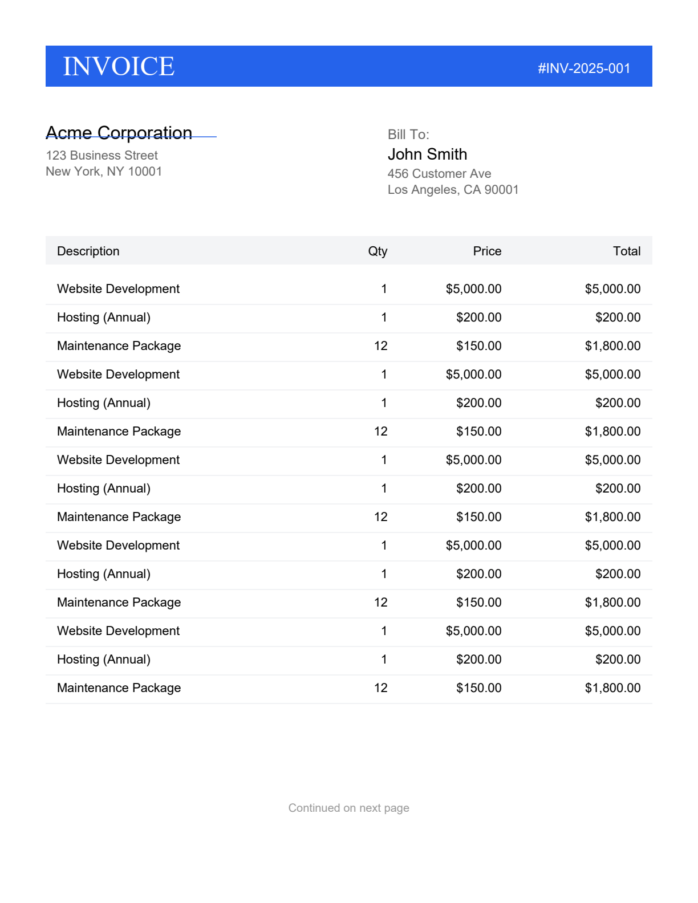
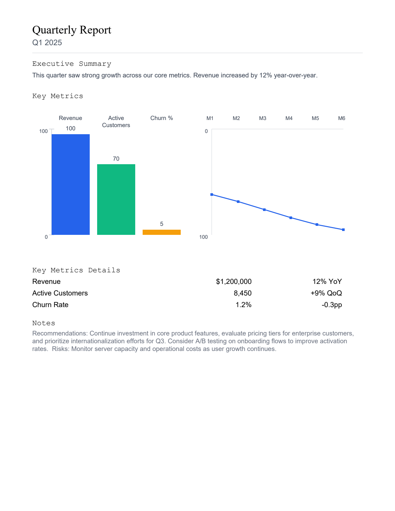

# TinyPdf C#

[](https://dev.to/iancowley/i-built-a-minimal-zero-dependency-pdf-library-for-c-because-i-hate-bloat-58b1)
[](https://www.nuget.org/packages/TinyPdf/)

> 📖 **Read the Deep-Dive**: **[I built a minimal zero-dependency PDF library for C# because I hate bloat.](https://dev.to/iancowley/i-built-a-minimal-zero-dependency-pdf-library-for-c-because-i-hate-bloat-58b1)**

A minimal PDF creation library for .NET 10, ported from the original [tinypdf](https://github.com/Lulzx/tinypdf) by Lulzx.

## Features
- 1041 lines of code
- Zero external dependencies
- Text rendering (`Helvetica`, `Times`, `Courier`) with alignment support
- Clickable links with optional underlining
- Shapes (Rectangles, Lines, Circles, Wedges)
- JPEG images
- Optional Flate (deflate) compression for PDF streams
- Markdown to PDF conversion
- Multiple pages with custom sizes

## Supported framework
This project targets `.NET 10`.

## Installation
Install the package via the .NET CLI:

```bash
dotnet add package TinyPdf
```

Alternatively, you can add the `TinyPdf.csproj` to your solution and reference it from your project:

```bash
dotnet add reference ../src/TinyPdf/TinyPdf.csproj
```

---

## 📄 Sample Outputs: Real Rendered PDF Previews

All sample documents below are generated programmatically using `TinyPdf` (pure C#, zero dependencies) in sub-millisecond execution times:

| Automated Business Invoice (~320 Ops) | Multi-Section Analytics Report (~56 Ops) |
| :---: | :---: |
|  |  |
| *Vector layout, dynamic line item tables, currency formatting, and totals (0.33 ms / doc)* | *Headings, structured grids, shaded backgrounds, and metric summaries (0.06 ms / doc)* |

| Vector Wedge Pie Chart (~20 Ops) | POS Thermal Receipt (~18 Ops) |
| :---: | :---: |
|  |  |
| *Precise mathematical arc and wedge vector slices with color fills (0.05 ms / doc)* | *Compact monospace thermal receipt layout with barcodes and itemization (0.04 ms / doc)* |

---

## Usage

### Simple PDF
```csharp
using TinyPdf;

var builder = TinyPdfCreate.Create();
// disable compression if you need uncompressed streams
// builder.Compress = false;

builder.Page(ctx => {
    ctx.Text("Hello World", 50, 700, 24);
    ctx.Rect(50, 650, 100, 20, "#FF0000");
});

byte[] pdf = builder.Build();
File.WriteAllBytes("output.pdf", pdf);
```

### Markdown to PDF
```csharp
using TinyPdf;

// disable compression via options
var options = new TinyPdfCreate.MarkdownOptions(Compress: false);
string md = "# Header\n\nThis is a paragraph.\n\n- List item";
byte[] pdf = TinyPdfCreate.Markdown(md, options);
File.WriteAllBytes("markdown.pdf", pdf);
```

### Advanced Page Options
```csharp
builder.Page(842, 595, ctx => { // A4 Landscape
    ctx.Line(0, 0, 842, 595, "#0000FF", 2);
});
```

### Charts and Shapes
```csharp
builder.Page(ctx => {
    // ctx.Circle(cx, cy, radius, fill, stroke, lineWidth)
    ctx.Circle(100, 700, 50, "#3498db");

    // ctx.Wedge(cx, cy, radius, startAngle, endAngle, fill, stroke, lineWidth)
    ctx.Wedge(300, 700, 50, 0, 90, "#e74c3c", "#000000", 2);
});
```

### Clickable Links
```csharp
builder.Page(ctx => {
    ctx.Text("Visit our website", 50, 700, 12);
    // Link(url, x, y, width, height, options)
    ctx.Link("https://github.com/ian-cowley/tinypdf-csharp", 50, 700, 100, 12, new TinyPdfCreate.LinkOptions(Underline: "#2563eb"));
});
```

## Running tests
From the repository root run:

```bash
dotnet test
```

## Benchmarks
To run the high-concurrency performance tests (1000 iterations per example):
```bash
dotnet run --project benchmarks/PerformanceTests/PerformanceTests.csproj
```

Alternatively, to run the BenchmarkDotNet suite:
```bash
dotnet run -p benchmarks/TinyPdf.Benchmarks
```

## Performance Results
The following results were measured on **AMD Ryzen AI 9 HX 370** generating 1,000 PDFs in parallel per document type with the **PB-22 Zero-Copy PooledBufferWriter** memory recycler:

| Example | Iterations | Total Time (ms) | Avg Latency | Throughput | Complexity |
| :--- | :---: | :---: | :---: | :---: | :--- |
| **Receipt** | 1,000 | 49.91 ms | **0.0499 ms** | **20,036 PDFs/s** | Methods: ~18 |
| **PieChart** | 1,000 | 57.26 ms | **0.0573 ms** | **17,464 PDFs/s** | Methods: ~20 |
| **Report** | 1,000 | 67.66 ms | **0.0677 ms** | **14,780 PDFs/s** | Methods: ~56 |
| **Resume** | 1,000 | 146.42 ms | **0.1464 ms** | **6,830 PDFs/s** | Markdown: ~100 lines |
| **Letter** | 1,000 | 209.26 ms | **0.2093 ms** | **4,778 PDFs/s** | Markdown: ~60 lines |
| **Invoice** | 1,000 | 336.82 ms | **0.3368 ms** | **2,969 PDFs/s** | Methods: ~320 |

### Zero-Copy Memory Architecture (PB-22 Optimization)
Eliminates defensive byte array heap allocations during PDF binary generation via zero-copy `PooledBufferWriter.GetMemory`:
- **Zero GC Pressure**: Output buffers are recycled directly from the shared memory pool.
- **100% Native Pure C#**: Zero unmanaged wrappers or native DLL dependencies.
- **Test Suite**: 18/18 rendering and serialization tests pass cleanly.

## Publishing (Maintainers)
To release a new version to NuGet and GitHub:
1. Open PowerShell in the repository root.
2. Run: `./release.ps1`
3. Follow the prompts for the commit message.

The script will automatically increment the patch version, commit, push, and create a GitHub tag, which triggers the CI/CD workflow.

## Notes
This C# port preserves the core logic of the original TypeScript library (font width tables and PDF object serialization) so generated PDFs are compatible in structure. The library is intentionally small and dependency-free to keep it easy to embed in small projects.

By default output streams are compressed (FlateDecode) — set `builder.Compress = false` or pass `new TinyPdfCreate.MarkdownOptions(Compress: false)` to `TinyPdfCreate.Markdown` to disable compression.

Security: do not commit secrets or sensitive configuration to this repository. Use `dotnet user-secrets` or environment variables for local development.

---

## 🆕 What's New in v0.1.11

- **CRITICAL BUG FIX: SFNT `'head'` table `unitsPerEm` at byte offset 18** — the previous implementation read from offset 36, producing incorrect font metrics for TrueType fonts.
- **TrueType font metrics parser with full SFNT table directory navigation** — correctly traverses the SFNT table directory to locate and parse any named table.
- **AFM (Adobe Font Metrics) parser for Type1 font metrics** — enables accurate character width lookup for Type1 PostScript fonts.
- **22 tests** passing (100 %).

---

## Credits

Developed by Ian Cowley and Antigravity (Google DeepMind).


